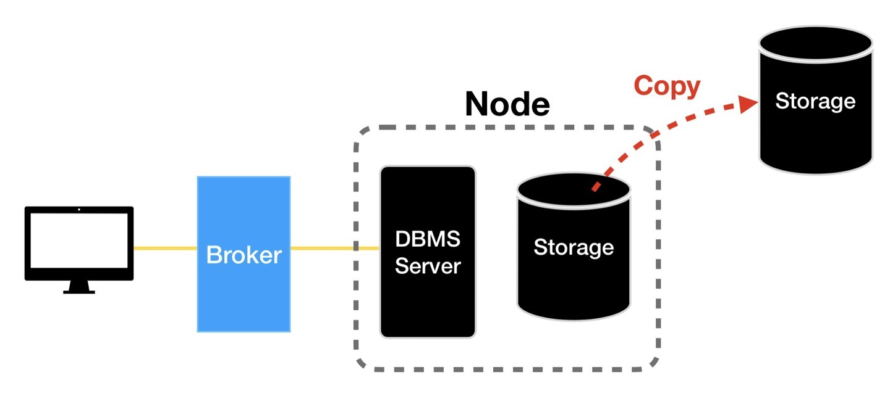
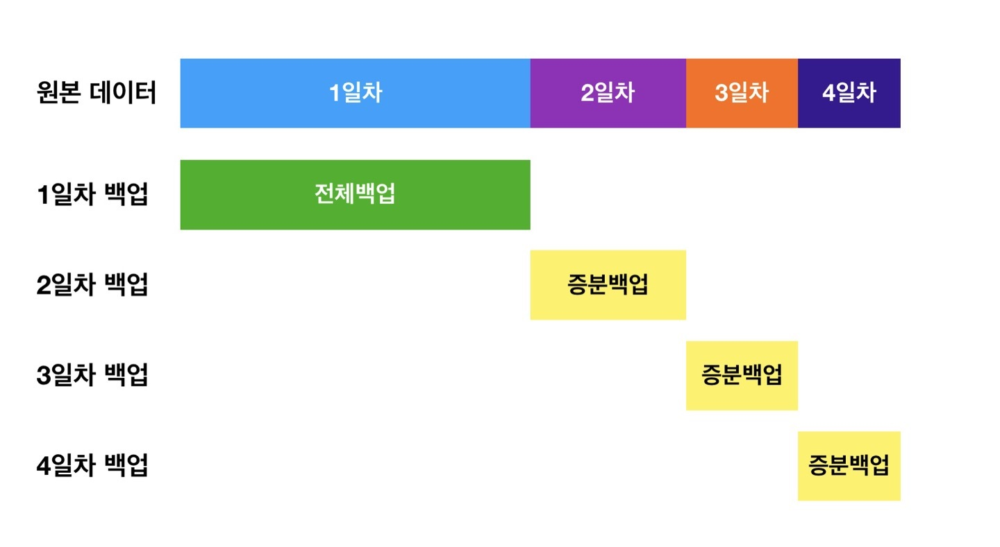
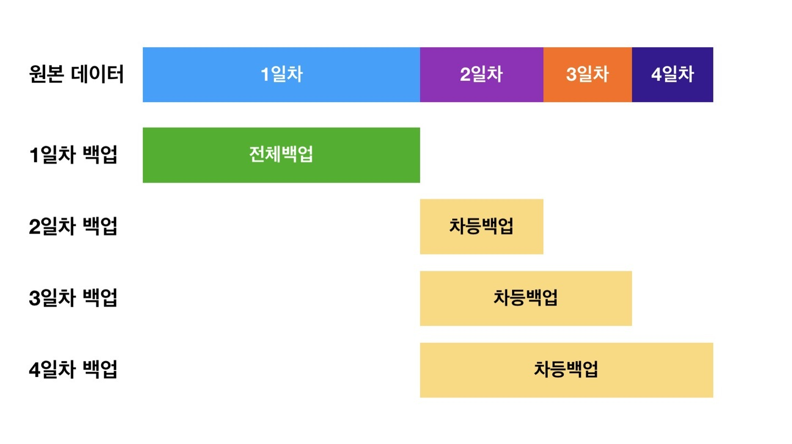
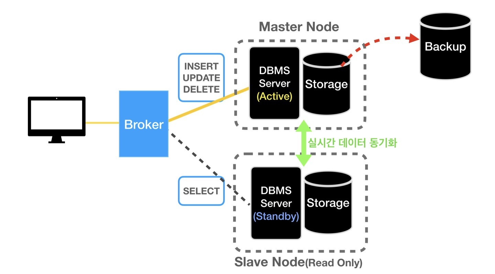
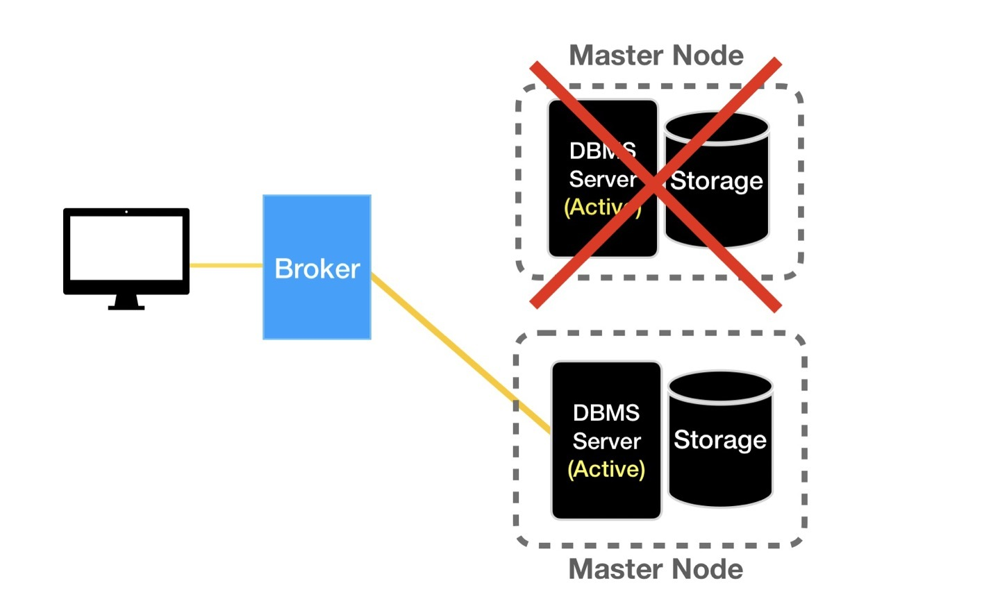

# 07. 백업과 복구
# 백업(Backup)

## 1. 백업이란?

 백업은 데이터 손상 시, 원본 데이터를 복원할 목적으로 원본 파일의 복사본을 제2의 또는 제3의 저장소에 저장하는 것이다.

 데이터는 소프트웨어 또는 하드웨어 오류, 인사 사고, 데이터 손상, 악의적인 공격, 실수로 인한 데이터 삭제 등으로 장애가 발생할 수 있다. 따라서 백업본을 통해 이전 시점의 데이터를 복원할 수 있어야 예기치 못한 상황에서 비즈니스를 신속하게 복구할 수 있게 된다.

 실시간으로 데이터를 복사하는 미러링(복제, HA), 데이터를 보관을 위해 다른 저장소에 저장하는 ‘아카이브’와 백업은 개념적으로 구분된다.


 ## 2. DB 백업의 고려사항

DB의 데이터를 일반적인 데이터처럼 단순히 백업하기에는 다음과 같은 유의사항이 존재한다.

- 데이터가 끊임없이 변화함.
- 원하는 수준의 복구가 가능해야함. 기업마다 목표로 하는 RTO, RPO가 있음.
    - **RTO(복구 시간 목표)**
        
        백업 스토리지로부터 파일을 복구하고 정상적인 운영 상태로 돌아가는 데 걸리는 최대 시간. 다르게 말하면, RTO는 기업이 감내할 수 있는 최대 다운타임 시간에 해당함. 기업의 RTO가 2시간이라면 2시간이 넘는 가동 중단을 견딜 수 없는 것이다.
        
    - **RPO(복구 시점 목표)**
        
        백업 스토리지로부터 복구하여 정상 운영 상태를 재개해야 하는 최대 파일 저장 기간. RPO에 따라 최소 백업 빈도가 결정된다. 예를 들어, 기업의 RPO가 5시간이라면 시스템은 최소 5시간마다 데이터를 백업해야 한다.
        

때문에, 각 서비스의 상황에 맞게 백업을 진행해야 한다.

## 3. 백업 데이터량

서비스 관리자는 백업을 어디에 얼마나 할 지 결정해야한다. **3 - 2 - 1원칙**은 과거부터 지금까지 통용되는 백업 위치에 대한 전략이다. 이 원칙에 따라 백업을 해두면 랜섬웨어 등 다양한 공격이나 재해에서 높은 안전성을 보장할 수 있다.

**3 : 기본 데이터1, 백업 데이터2, 총 3개의 데이터를 보관**

**2 : 2가지 이상의 미디어(저장 매체)로 데이터 저장**

**1 : 백업본 하나는 물리적으로 완전히 분리된 곳(off-site)에 보관**

**(안전을 위해 백업 종료 후 오프사이트 서버 off)**


이 원칙에 따라 백업을 해두면 랜섬웨어 등의 위협에서 안전하게 데이터를 유지할 수 있다.

## 4. 백업의 유형

### **1) 서비스 운영기준**

**콜드 백업(offline backup)**

서비스 운영 중단 후 백업 진행

- 장점
    - 시스템 리소스 활용에 제한이 없음
    - 백업 도중 변경되는 데이터가 없어 안전함
- 단점
    - 서버 접근이 불가함
    - 복구 시간이 오래걸림

**핫 백업(online backup)**

서버 운영하며 백업 수행, 대부분의 서비스에서 수행되는 백업 유형임.

- 장점
    - 서버가 끊기지 않고 계속 운영됨
- 단점
    - 스토리지 읽기 성능 부하로 서비스 운영에 지장이 갈 수 있음
    - 수시로 변경되는 데이터 백업 주의 필요

**웜백업(warm backup)**

시스템은 종료하지 않으나, 외부 사용자의 내부 시스템 접근을 막고 백업 수행

### **2) 백업량 기준**

**전체백업(Full backup)**


전체 데이터를 그대로 백업하는 방법이다. 초기 또는 첫 번째 백업으로 일반적으로 사용이 되고 그 다음으론 증분 또는 차등 백업이 사용된다. 여러 증분 또는 차등 백업 한 후, 다시 새로운 전체 백업을 시작하는 것이 일반적이다.

- 장점
    - 복원이 빠르고 파일의 전체 목록으로 쉽게 관리 할 수 있다.
- 단점
    - 각각의 파일의 전체백업이 매번 이루어질 때마다 오래 걸린다.
    - 증분백업과 차등백업과 비교해보아서 가장 많은 저장 공간을 차지한다.
    - 동일한 파일을 반복적으로 저장하는 비효율이 발생할 수 있다.

**증분백업(Incremental backup)**



이전 백업 이후 변경된 데이터만 백업하는 방식이다. 전체 백업을 수행하는 데 걸리는 시간과 저장 공간을 줄이기 위한 방법으로 도입되었다.

- 장점
    - 백업속도가 가장 빠르다.
    - 이미 있는 파일을 다시 저장하는 비효율이 없다. 이에 따라 저장 공간도 다른 백업에 비해 매우 적게 사용한다.
- 단점
    - 전체백업본 복구 후 순차적으로 증분 백업들을 복구해야 하므로 복구 시간이 길다.

**차등백업(Differential backups)**



차등 백업은 마지막 전체 백업 이후 변경된 모든 데이터를 백업하는 방식이다. 증분 백업과의 차이는 전체 백업 이후의 변경사항을 모두 백업한다는 것이다.

- 장점
    - 전체 백업에 비해 백업속도가 빠르다.
    - 마지막 전체 백업 이후에 변경된 파일만 각 차등 백업 실행에 복사되기 때문에 저장 한 후 공간 전체 백업을 보다 효율적으로 사용한다.
    - 전체 백업과 가장 마지막 차등백업본만 복구하면 되므로 복구속도가 빠르다.
- 단점
    - 백업속도나 저장 공간 효율은 증분 백업보다 좋지 않다.
    - 복원 속도가 전체 백업보다는 느리다.

***트랜잭션 로그 백업**

로그 백업은, 데이터베이스를 백업 받는게 아니고 그동안 발생했던 트랜잭션 로그(지금까지 이루어졌던 모든 동작들의 로그)를 백업받는 방법이다. 이전 백업을 복구한 데이터에 로그의 질의를 순차적으로 읽어 가장 최근의 상태로 복구할 수 있다. 로그 백업 진행 후 로그 파일은 삭제되어 저장 공간의 효율적 사용이 가능하다.

**백업전략**

보통 전체 백업 사이에 차등 백업과 증분 백업을 하는 전략을 사용한다. 사용하는 서비스의 특성에 맞게 주기를 결정한다.

ex) 전체 백업(1주 1회 2주분) / 차등 백업 (1일 1회 7일분) / 증분 백업(1시간 1회 3일분)


# 복구(Recovery)

데이터 복구는 백업한 데이터들을 이용하여 손상된 데이터를 살리는 작업을 의미한다. 아래의 그림은 데이터에 문제 발생 시 복구 절차에 대한 예시이다. 이를 통해 백업과 복구의 일반적인 절차를 이해해보자.


1. 원본 데이터에 문제가 발생한다.
2. 문제 발생 시 작업했던 트랜잭션의 로그를 백업한다.
3. 전체 백업본을 먼저 복구한다.
4. 마지막 차등 백업본을 복구한다.
5. 증분 백업본을 복구한다.
6. 마지막 로그의 백업본으로 가장 최신의 데이터볼륨으로 복원한다.

물론 DBMS마다 세부적인 절차는 다르겠지만, 일반적으로 복구는 이런 과정으로 이루어진다. 참고로 큐브리드는 차등백업은 하지 않고, 전체백업과 증분백업, 로그를 이용한 백업이 가능하다.

로그를 이용한 복구 작업의 상세한 내용은 아래의 링크를 참고하면 도움 될 것이다.
http://contents2.kocw.or.kr/KOCW/document/2016/catholic/hwangbyungyeon/15.pdf

# HA(High Availability or Replication)

HA(복제)는 메인 서버 또는 DB에 예기치 못한 문제가 생겼을 때, 서비스가 중단되는 경우를 방지하기 위한 개념이다. 서로 다른 장비에 동일한 정보를 가진 독립적인 예비 서버를 만들어놓고, 문제 발생 시 즉시 예비 서버로 연결하여 서비스의 중단에 대비할 수 있다.


 위의 그림처럼 Master 노드를 복제(Replication)한 Slave 노드를 구축하고 데이터를 실시간으로 동기화 시켜서 동일한 데이터를 가지도록 한다. 이 동기화는 네트워크 연결을 통해 트랜잭션 로그를 공유하며 이뤄진다.

 ```
노드(Node)란?
큐브리드는 분산 시스템(또는 클러스터 환경)에서 독립적인 역할(서비스, 읽기/쓰기 요청 처리 등)을 수행할 수 있는 단위를 '노드'라는 용어로 표현한다. 각 노드는 독립적인 DBMS서버와 데이터 저장 장치(Storage)의 집합이라고 볼 수 있다.
```
 그리고 노드는 보통 Active, Standby 상태로 구분된다. Active는 읽고 쓰는 작업이 모두 가능한 메인 서버임을 의미하고, Standby는 읽는 작업만 가능한 상태임을 의미한다.

 Slave 노드를 단순히 예비 자원으로 두기에는 낭비이므로 SELECT질의 등의 Read작업은 Slave 노드에서 처리하고, 데이터의 변경과 관련된 질의는 Master 노드에서 처리한다.

 또한, 읽기 요청 처리의 부하를 줄이기 위해 레플리카 노드를 추가하기도 한다. 레플리카 노드도 Standby 상태로 읽기 요청 처리가 가능하지만, Failover는 불가능하다. 아래 그림은 Failover을 나타낸 것이다.



만약 마스터 노드에 문제가 생겨 서비스 운영에 장애가 생길 수
 있는 경우에는, 곧바로 Slave노드를 메인 서버로 전환하여 서비스 운영에 차질이 없도록 대비할 수 있다. 이처럼 Slave 노드가 Master로 역할을 변경하는 것을 Failover(페일오버)라고 한다.
